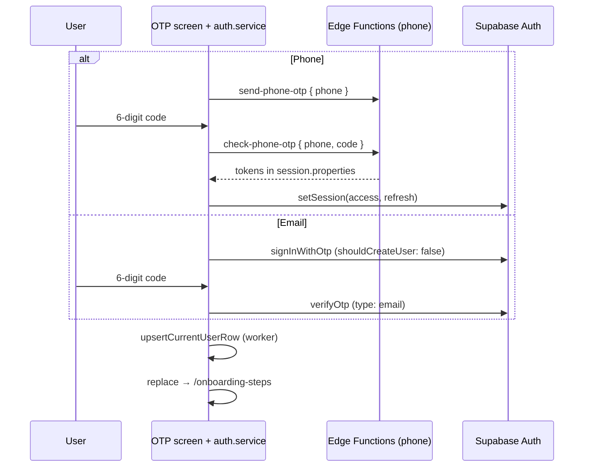

# Huzly mobile auth: email & phone OTP

Architecture for passwordless OTP in the React Native (Expo Router) app. **Code touchpoints:** `app/auth/otp.tsx` (UI + routing), `src/lib/auth/auth.service.ts` (production helpers).

---

## End-to-end sequence (both channels)

1. **Send** — User submits phone (E.164) or email on an upstream screen; the app calls `sendPhoneOtp` or `sendEmailOtp`.
2. **Enter code** — User lands on the OTP screen, enters a 6-digit code (with platform autofill where supported).
3. **Verify** — `verifyPhoneOtp` or `verifyEmailOtp` validates the code and establishes (or confirms) the Supabase session.
4. **Profile** — On success, the app calls `upsertCurrentUserRow` with **worker** role, clears the OTP timer, and **replaces** navigation to `/onboarding-steps`.

---

## Routing and UI (`app/auth/otp.tsx`)

| Concern | Behavior |
|--------|----------|
| **Query params** | **`email`** — if present, mode is **email**. Otherwise mode is **phone** (expect **`phone`** param). |
| **`next` (optional)** | May be passed for future deep-linking; **current behavior:** successful verification navigates to **`/onboarding-steps`** (not driven by `next`). |
| **Code input** | Single 6-digit OTP field. |
| **Resend cooldown** | **5 minutes**, persisted in **AsyncStorage** under key **`otp_timer_key`**. |
| **Display** | Phone and email are **masked** in the UI (not full plaintext). |
| **Autofill** | Platform hints: **`sms-otp`** vs **`one-time-code`** as appropriate for SMS vs email flows. |
| **After verify** | `upsertCurrentUserRow` (worker) → clear timer key → `router.replace` to onboarding. |

---

## Phone OTP (production — `auth.service.ts`)

### Send

- **`sendPhoneOtp`** invokes a Supabase **Edge Function** named **`send-phone-otp`** with body `{ phone }` where `phone` is **E.164**.
- The **active implementation does not** use `supabase.auth.signInWithOtp` for phone on the client.

### Verify

- **`verifyPhoneOtp`** invokes Edge Function **`check-phone-otp`** with `{ phone, code }`.
- If the response includes **`data.session.properties`** with **`access_token`** and **`refresh_token`**, the client calls **`supabase.auth.setSession`** with those tokens to establish the Supabase session.
- If **`verified`** is false (or equivalent failure), surface an **invalid OTP** error to the user.

### Supabase / API touchpoints (phone)

| Step | Touchpoint |
|------|------------|
| Send OTP | Edge Function `send-phone-otp` |
| Verify + session | Edge Function `check-phone-otp` → `supabase.auth.setSession` |

---

## Email OTP (`auth.service.ts`)

### Send

- **`sendEmailOtp`** normalizes email (**trim**, **lowercase**).
- Calls **`supabase.auth.signInWithOtp`** with **`shouldCreateUser: false`** — i.e. **passwordless sign-in for existing users only**. New sign-ups via email must use a different flow (or a different `shouldCreateUser` policy) if product requires account creation here.

### Verify

- **`verifyEmailOtp`** calls **`supabase.auth.verifyOtp`** with:
  - `email`
  - `token` (6-digit code)
  - **`type: 'email'`**
- Session handling follows **whatever the Supabase JS client returns** on success (standard persisted session).

### Supabase / API touchpoints (email)

| Step | Touchpoint |
|------|------------|
| Send OTP / magic link mail path | `supabase.auth.signInWithOtp` (Auth API + project email/SMTP settings) |
| Verify | `supabase.auth.verifyOtp` (`type: 'email'`) |

---

## Resend (`resendOtp`)

- **Phone** → **`sendPhoneOtp`** (Edge Function path).
- **Email** → **`sendEmailOtp`** (`signInWithOtp`).
- **Neither identifier present** → error.
- The OTP screen passes role **Worker** for phone resend where applicable (e.g. metadata or Edge Function contract — align with your `send-phone-otp` implementation).

---

## Contrast: legacy / reference (`auth-enhanced.service.ts`)

A separate module documents an **alternative** pattern:

- Phone via **`supabase.auth.signInWithOtp`**
- Verify via **`verifyOtp`** with **`type: 'sms'`**

That file is **reference only**. It is **not** the live production phone path, which is **Edge Functions + `setSession`**.

---

## Security & product notes

1. **Email OTP scope** — With **`shouldCreateUser: false`**, email OTP is **sign-in for accounts that already exist**. It does **not** create users; accidental or malicious “sign up” attempts may get a generic failure or no user creation depending on Supabase settings.
2. **Phone OTP** — Rate limits, template content, and whether a user is created or linked are defined by **`send-phone-otp`** / **`check-phone-otp`** and Supabase Auth configuration, not by the Expo client alone.
3. **Session trust** — Phone flow trusts tokens returned from **`check-phone-otp`**; ensure the Edge Function validates the code server-side and only returns tokens on success.
4. **Cooldown** — The 5-minute resend timer is **client-side** (AsyncStorage); it improves UX and reduces accidental spam but is **not** a server-side rate limit. Keep Edge Function / Auth rate limits in Supabase as the real guardrail.

---

## Quick reference diagram

